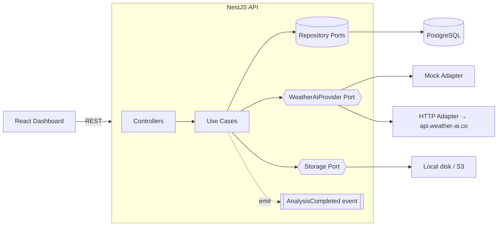

# 🌳 Agroforestry Analyzer

A clean, production-shaped application built on the [WeatherAI developer API](https://weather-ai.co/docs).
Register land **plots**, upload drone/satellite imagery, run **tree-canopy analyses**
(`POST /v1/trees/analyze`), track canopy health over time, and pull **agronomic weather
insights** for each plot.

The emphasis is on **architecture and engineering judgment**: a hexagonal NestJS backend
behind a typed provider abstraction, a Postgres data model via Prisma, a React dashboard, full
test coverage, containerised deploy, and CI — all runnable **with no API key** thanks to a
mock provider.

| | |
|---|---|
| **Live app** | _<your Render web URL>_ |
| **Live API + Swagger** | _<your Render API URL>_/docs |
| **Stack** | NestJS 11 · Prisma · PostgreSQL 16 · React 19 + Vite · TypeScript · Docker · Render |

---

## Why this design

> The task says "build a *simple* application." I read that as: pick one coherent domain story
> and implement it *well*, rather than thinly wrapping every endpoint. The agroforestry flow
> (plots → imagery → canopy analysis → history → weather context) exercises file uploads,
> persistence, an external API, async-ready orchestration, and resilience — a realistic slice
> of "the core systems and scaling challenges" the brief mentions.

Key decisions and the trade-offs behind them:

- **Hexagonal / Ports & Adapters + DDD-lite.** Each module is split into `domain` (entities +
  repository *ports*), `application` (use cases), `infrastructure` (Prisma/HTTP adapters), and
  `interface` (controllers + DTOs). The application layer depends only on interfaces, so it's
  unit-testable with in-memory fakes and swappable at the edges.
- **Provider as a strategy.** One `WeatherAiProvider` port, two adapters: a resilient
  `HttpWeatherAiProvider` (live) and a deterministic `MockWeatherAiProvider` (offline). Selected
  by `WEATHER_AI_MODE` — switching mock ↔ live is a config change, **zero code edits**. This is
  what lets the whole project run and be graded without a key.
- **Resilience at the boundary.** The live adapter wraps every call in a timeout → retry
  (exponential backoff + jitter, 5xx/network only) → circuit breaker, and watches
  `X-RateLimit-*` headers. Failures are mapped to a clean `502` and an auditable `FAILED` record.
- **Event-driven seam.** Completing an analysis emits an `AnalysisCompleted` domain event
  (`EventEmitter2`) consumed by an audit listener — the place where webhooks/metrics/notifications
  would later attach, without touching the write path.
- **Deliberately *not* over-engineered.** No CQRS framework, no event sourcing, no message broker.
  Analysis runs synchronously (the mock is instant) but the use case is queue-ready — BullMQ/Redis
  is the documented scale path, avoiding a third service for the demo. Plain CRUD modules stay
  plain. Judgment over ceremony.

---

## Architecture

```
┌──────────────┐     HTTPS/JSON      ┌─────────────────────────────────────────────┐
│  React (web) │ ──────────────────▶ │            NestJS API  (/api/v1)            │
│  Vite + RQ   │                     │                                             │
└──────────────┘                     │  interface  → controllers, DTOs, validation │
                                     │  application→ use cases (PlotsService, …)    │
                                     │  domain     → entities + repository PORTS    │
                                     │  infra      → Prisma repos, provider, storage│
                                     └───────┬───────────────┬──────────────┬──────┘
                                             │ port          │ port         │ port
                                       ┌─────▼─────┐  ┌───────▼──────┐  ┌────▼─────┐
                                       │  Postgres │  │ WeatherAiProvider │ │ Storage │
                                       │ (Prisma)  │  │ mock │ http(live)│ │  disk/S3│
                                       └───────────┘  └──────────────┘  └──────────┘
```



### Modules

| Module | Responsibility | Key route(s) |
|---|---|---|
| `plots` | CRUD for land parcels | `/api/v1/plots` |
| `analyses` | Upload imagery → analyse → persist → emit event; history | `POST /api/v1/plots/:id/analyses`, `GET .../analyses`, `GET /api/v1/analyses/:id` |
| `weather` | Current conditions + AI agronomic insight for a plot | `GET /api/v1/plots/:id/insight` |
| `quota` | Remaining monthly analysis quota | `GET /api/v1/quota` |
| `health` | DB liveness (Terminus) | `GET /health` |

Cross-cutting: zod-validated config, pino structured logging (request-id correlation), helmet,
CORS, throttler (100 req/min/IP), global **RFC 7807 `problem+json`** exception filter, URI
versioning, and OpenAPI/Swagger at `/docs`.

---

## Project structure

```
.
├── apps/
│   ├── api/                     # NestJS backend
│   │   ├── prisma/              # schema, migrations, seed
│   │   ├── src/
│   │   │   ├── config/          # zod env validation + typed config
│   │   │   ├── common/          # filters, validators, DTOs, exceptions
│   │   │   ├── infrastructure/  # PrismaService
│   │   │   ├── shared/          # weather-ai provider (port + adapters), storage
│   │   │   └── modules/         # plots · analyses · weather · quota · health
│   │   ├── test/                # e2e + in-memory fakes
│   │   └── Dockerfile
│   └── web/                     # React + Vite dashboard
├── render.yaml                  # Render blueprint (API + Postgres + static site)
├── docker-compose.yml           # local Postgres
└── .github/workflows/ci.yml     # lint · test · build
```

---

## Getting started (local)

### Prerequisites
- Node ≥ 20, [pnpm](https://pnpm.io) ≥ 9, Docker (for Postgres)

### 1. Install & configure
```bash
pnpm install
cp .env.example apps/api/.env      # API config (defaults work out of the box)
cp apps/web/.env.example apps/web/.env
```
> The defaults use `WEATHER_AI_MODE=mock`, so **no API key is required**. The example
> `DATABASE_URL` points at `localhost:5433` to match the bundled Compose file.

### 2. Database
```bash
pnpm db:up                                   # start Postgres (docker compose)
pnpm --filter @agro/api prisma:migrate       # apply migrations
pnpm --filter @agro/api prisma:seed          # seed sample plots
```

### 3. Run
```bash
pnpm --filter @agro/api start:dev            # API → http://localhost:3000  (Swagger at /docs)
pnpm --filter @agro/web dev                  # Web → http://localhost:5173
```

Open the dashboard, create a plot, and upload any image — you'll get a populated analysis,
history, and an agronomic insight panel.

> **Tip:** to exercise the analysis endpoint from Swagger you need a real image file (PNG/JPEG/
> WEBP/TIFF). Validation checks the file's **magic bytes**, not just its declared content-type.

---

## API reference

Base URL: `/api/v1` · Interactive docs: **`/docs`** · Errors: `application/problem+json` (RFC 7807).

| Method | Path | Description |
|---|---|---|
| `POST` | `/plots` | Create a plot |
| `GET` | `/plots` | List plots (paginated) |
| `GET` | `/plots/:id` | Get a plot |
| `PATCH` | `/plots/:id` | Update a plot |
| `DELETE` | `/plots/:id` | Delete a plot |
| `POST` | `/plots/:id/analyses` | Upload imagery (`multipart/form-data`, field `image`) → run analysis |
| `GET` | `/plots/:id/analyses` | Analysis history for a plot (paginated) |
| `GET` | `/analyses/:id` | Get a single analysis |
| `GET` | `/plots/:id/insight` | Current weather + AI agronomic insight |
| `GET` | `/quota` | Remaining monthly analysis quota |
| `GET` | `/health` | Liveness + DB check |

Example:
```bash
curl -F "image=@field.png" http://localhost:3000/api/v1/plots/<PLOT_ID>/analyses
```

---

## Mock vs. live provider

| | Mock (default) | Live |
|---|---|---|
| `WEATHER_AI_MODE` | `mock` | `live` |
| API key | not needed | `WEATHER_AI_API_KEY=wai_…` required |
| Behaviour | deterministic results seeded from the image bytes (stable demos & tests) | real calls to `https://api.weather-ai.co` with retries + circuit breaker |

Switch to live with **no code changes**:
```bash
WEATHER_AI_MODE=live
WEATHER_AI_API_KEY=wai_xxxxxxxx
```

---

## Testing

```bash
pnpm --filter @agro/api test       # unit (use cases, provider, validator, circuit breaker)
pnpm --filter @agro/api test:e2e   # full HTTP e2e via supertest — no DB/network needed
pnpm -r lint                       # eslint across both apps
pnpm -r build                      # type-check + build api + web
```

Tests run **without a database, network, or API key**: repositories and storage are swapped for
in-memory fakes and the provider uses the mock. The same commands run in CI
(`.github/workflows/ci.yml`).

---

## Deployment (Render)

The repo ships a `render.yaml` blueprint that provisions three resources: a **Postgres**
database, the **API** (Docker web service), and the **web** dashboard (static site).

1. Push this repo to GitHub.
2. Render Dashboard → **New → Blueprint** → pick the repo → Apply. The API runs
   `prisma migrate deploy` on every boot.
3. After the first deploy, set these `sync: false` env vars and redeploy:
   - **agro-api** → `PUBLIC_BASE_URL` = the API's URL (e.g. `https://agro-api.onrender.com`),
     `CORS_ORIGINS` = the web URL. (Set `WEATHER_AI_MODE=live` + `WEATHER_AI_API_KEY` to use the
     real API.)
   - **agro-web** → `VITE_API_URL` = the API's URL.

The API image is also runnable anywhere Docker is:
```bash
docker build -f apps/api/Dockerfile -t agro-api .
docker run -p 3000:3000 -e DATABASE_URL=… -e WEATHER_AI_MODE=mock agro-api
```

### Production notes / honest caveats
- **Image storage** uses local disk behind a `StoragePort`. On an ephemeral host (Render free
  tier) uploaded files don't survive a restart — the abstraction is in place so an S3/R2 adapter
  is a drop-in swap. Analysis *records* persist in Postgres regardless.
- Analysis is synchronous; the use case is structured to move behind a **BullMQ** queue when image
  sizes/volume justify it.
- Render's free Postgres expires after ~30 days; for a long-lived demo use a paid plan or an
  external Postgres URL.
